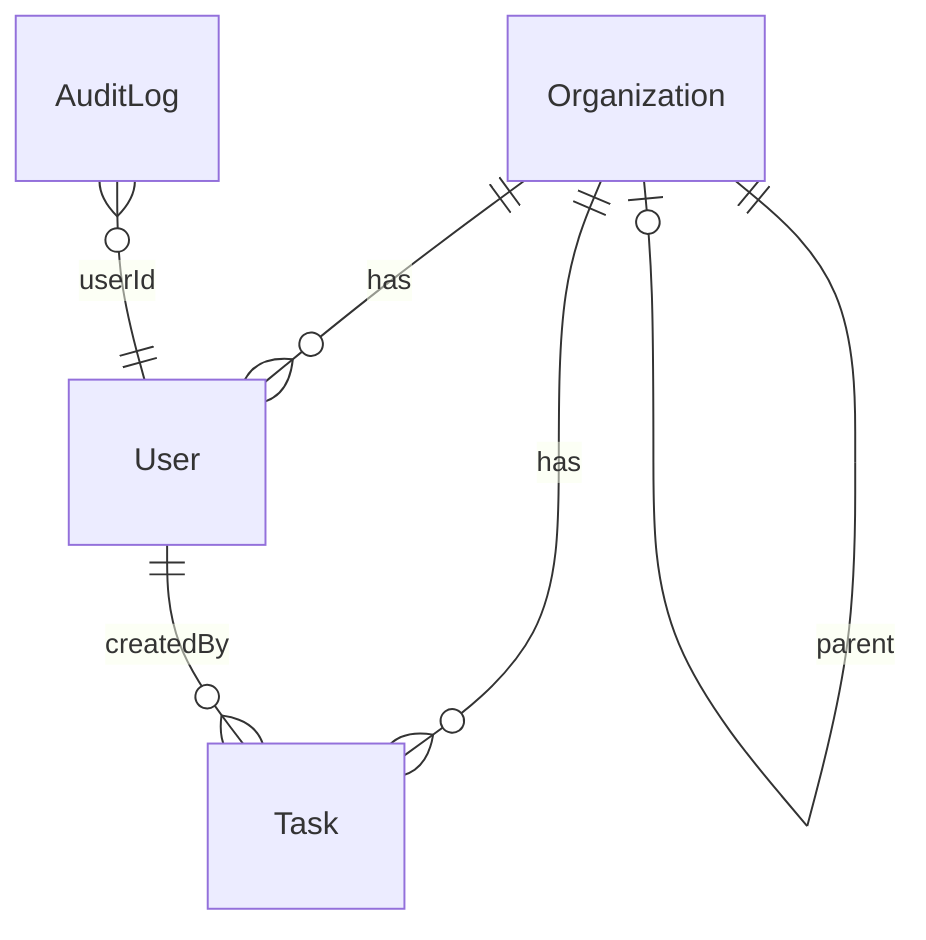

# Secure Task Management System

**Repository naming**: `bturbovets-<uuid>` (e.g. `bturbovets-0a19fc14-d0eb-42ed-850d-63023568a3e3`)

A full-stack Task Management System with **role-based access control (RBAC)** in an **NX monorepo**, built for the Full Stack Coding Challenge.

---

## Setup Instructions

### Prerequisites

- Node.js 18+
- npm

### Install dependencies

```bash
npm install
```

### Environment variables

Copy `.env.example` to `.env` in the project root (or set in the shell when running the API):

```bash
cp .env.example .env
```

Configure:

| Variable        | Description                    | Default                    |
|----------------|--------------------------------|----------------------------|
| `PORT`         | API server port                | `3333`                     |
| `DB_PATH`      | SQLite database file path     | `data/tasks.db`            |
| `JWT_SECRET`   | Secret for signing JWTs        | (required in production)   |
| `JWT_EXPIRES_IN` | JWT expiry (e.g. `7d`)      | `7d`                       |
| `AUDIT_LOG_DIR`  | Directory for audit log files | `logs`                     |

### Run backend (NestJS API)

```bash
npm run start:api
```

API runs at **http://localhost:3333**. On first run, the DB is created and seed data is inserted (see **Seed users** below).

### Run frontend (Angular dashboard)

In a second terminal:

```bash
npm run start:dashboard
```

Dashboard runs at **http://localhost:4200**. The dev server proxies `/api` to `http://localhost:3333`, so the app talks to the API without CORS issues.

### Seed users

After the first `start:api`, the following users exist (password for all: **password123**):

| Email              | Role   | Organization |
|--------------------|--------|--------------|
| owner@acme.com     | Owner  | Acme Corp    |
| admin@acme.com     | Admin  | Acme Corp    |
| viewer@acme.com    | Viewer | Acme Corp    |
| admin@acmewest.com | Admin  | Acme West    |

Use **owner@acme.com** / **password123** to log in and access all features (including audit log).

---

## Architecture Overview

### NX monorepo layout

```
apps/
  api/          → NestJS backend (TypeORM, SQLite, JWT, RBAC)
  dashboard/    → Angular 18 frontend (TailwindCSS, CDK drag-drop)
libs/
  data/         → Shared TypeScript interfaces, DTOs, enums (Role, Permission, Task, User, etc.)
  auth/         → Reusable RBAC: permission checks, RequirePermission decorator
```

- **apps/api**: REST API, JWT auth, task CRUD, audit log. Depends on `libs/data` and `libs/auth` for types and permission metadata.
- **apps/dashboard**: SPA with login, task list, create/edit/delete, filters, sort, drag-and-drop. Uses `libs/data` types via direct HTTP types in the app.
- **libs/data**: Single source of truth for roles, permissions, and DTOs used by API and optionally by the dashboard.
- **libs/auth**: Permission constants and `hasPermission(role, permission)` used by the API’s `PermissionsGuard`; `RequirePermission(...)` decorator is used on controller methods.

### Rationale

- Shared **data** and **auth** libs keep API and (if needed) other consumers aligned on roles and permissions.
- NX allows building and testing `api`, `dashboard`, `data`, and `auth` independently and with cached runs.

---

## Data Model

### Schema (SQLite via TypeORM)

- **users**  
  `id` (UUID), `email` (unique), `passwordHash`, `role` (owner | admin | viewer), `organizationId`, `createdAt`, `updatedAt`.

- **organizations**  
  `id` (UUID), `name`, `parentId` (nullable, 2-level hierarchy), `createdAt`, `updatedAt`.

- **tasks**  
  `id` (UUID), `title`, `description` (nullable), `status` (todo | in_progress | done), `category`, `orderIndex`, `organizationId`, `createdById`, `createdAt`, `updatedAt`.

- **audit_logs**  
  `id` (UUID), `action`, `resource`, `resourceId` (nullable), `userId`, `userEmail`, `details` (nullable), `timestamp`.

### ERD (conceptual)



- **2-level org hierarchy**: `Organization.parentId` points to parent; users and tasks are scoped to an organization. Task visibility includes the user’s org and (for simplicity) parent/child orgs in the same hierarchy.

---

## Access Control and JWT

### Roles and permissions

- **Owner**: full task CRUD + audit log read.
- **Admin**: same as Owner (task CRUD + audit log read).
- **Viewer**: task read only.

Permissions are defined in `libs/data` (`Permission` enum, `ROLE_PERMISSIONS`). The API uses `libs/auth`: `hasPermission(role, permission)` and the `@RequirePermission(Permission.X)` decorator.

### Enforcement

- **JWT**: Issued at `POST /auth/login`. All other routes are protected by a global `JwtAuthGuard`; only `POST /auth/login` is marked `@Public()`.
- **Permissions**: Controllers use `@RequirePermission(...)`. A `PermissionsGuard` reads the decorator and checks the authenticated user’s role against required permissions via `hasPermission(...)`.
- **Task scope**: Tasks are filtered by the user’s organization (and hierarchy). Only tasks in the user’s org (or related parent/child orgs) are returned or updatable.

### Flow

1. Client sends credentials to `POST /auth/login`.
2. API validates and returns `{ access_token, user }`.
3. Client stores the token and sends `Authorization: Bearer <token>` on every request.
4. `JwtAuthGuard` validates the token and attaches the user to the request.
5. `PermissionsGuard` ensures the user’s role has the permissions required by the route’s `@RequirePermission(...)`.

---

## API Documentation

Base URL: `http://localhost:3333` (or via proxy at `http://localhost:4200/api` with path rewritten to `/`).

All endpoints except login require: `Authorization: Bearer <access_token>`.

### Auth

**POST /auth/login**

- Body: `{ "email": "string", "password": "string" }`
- Response: `{ "access_token": "string", "user": { "id", "email", "role", "organizationId" } }`
- Example:
  ```bash
  curl -X POST http://localhost:3333/auth/login -H "Content-Type: application/json" -d '{"email":"owner@acme.com","password":"password123"}'
  ```

### Tasks

**POST /tasks** (TaskCreate)

- Body: `{ "title": "string", "description?", "status?", "category?" }`
- Response: created task object.

**GET /tasks** (TaskRead)

- Query: `category`, `status` (optional).
- Response: array of tasks (scoped to user’s org/hierarchy).

**GET /tasks/:id** (TaskRead)

- Response: single task or 404.

**PUT /tasks/:id** (TaskUpdate)

- Body: `{ "title?", "description?", "status?", "category?", "orderIndex?" }`
- Response: updated task.

**DELETE /tasks/:id** (TaskDelete)

- Response: `{ "deleted": true }`.

**POST /tasks/reorder** (TaskUpdate)

- Body: `{ "ids": ["uuid", ...] }`
- Response: array of tasks in new order.

### Audit log (Owner/Admin only)

**GET /audit-log** (AuditLogRead)

- Query: `limit` (optional, default 100).
- Response: array of audit log entries.

---

## Testing

- **Backend**: Jest for API and libs.
  ```bash
  npm run test:api
  npm run test:data
  npm run test:auth
  ```
- **Frontend**: Jest for dashboard.
  ```bash
  npm run test:dashboard
  ```

---

## Future Considerations

- **Refresh tokens**: Short-lived access token + refresh token; store refresh tokens server-side and rotate on use.
- **CSRF**: For cookie-based or form-heavy flows, add CSRF tokens and validate on state-changing requests.
- **Production security**: Strong `JWT_SECRET`, HTTPS only, rate limiting, and security headers.
- **RBAC scaling**: Cache permission checks per role; consider attribute-based or policy engines if rules become complex.
- **Advanced delegation**: Allow Admins to assign roles within their org or delegate subsets of permissions.

---

## Bonus features implemented

- **Dark/light mode** toggle on the dashboard (persisted via `document.documentElement.classList`).
- **Drag-and-drop** reordering of tasks (Angular CDK).
- **Responsive** layout for mobile and desktop (Tailwind).

Task completion visualization (e.g. bar chart) and keyboard shortcuts can be added on top of the current dashboard and state.
