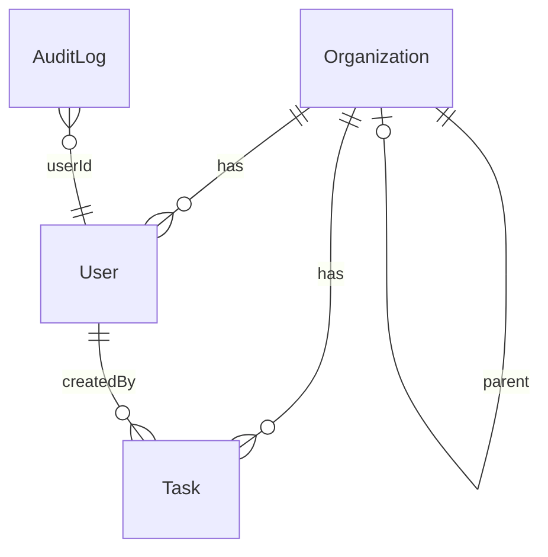

# Secure Task Management System

**Repository naming**: `bturbovets-<uuid>` (e.g. `bturbovets-0a19fc14-d0eb-42ed-850d-63023568a3e3`)

A full-stack Task Management System with **role-based access control (RBAC)** in an **NX monorepo**, built for the Full Stack Coding Challenge.

---

## Setup Instructions

### Prerequisites

- Node.js 18+
- npm

### Install dependencies

```bash
npm install
```

### .env Setup

Copy `.env.example` to `.env` in the project root:

```bash
cp .env.example .env
```

Configure the following variables:

| Variable      | Description                         | Example / Notes                                      |
|---------------|-------------------------------------|------------------------------------------------------|
| `PORT`        | API server port                     | `3333` (dashboard proxy expects this by default)     |
| `DB_PATH`     | SQLite database file path           | `data/tasks.db` — created automatically on first run |
| `JWT_SECRET`  | Secret for signing JWTs             | **Required**. Use a long random string in production |
| `JWT_EXPIRES_IN` | JWT expiry (e.g. `7d`, `24h`)   | `7d`                                                 |
| `AUDIT_LOG_DIR` | Directory for audit log files    | `logs`                                               |

**Important:**

- **JWT_SECRET**: Must be set. Use a strong, random value in production (e.g. `openssl rand -base64 32`).
- **DB config**: `DB_PATH` points to the SQLite file; the `data/` directory is created automatically if it doesn't exist.

### How to run both backend and frontend

**Terminal 1 – Backend (NestJS API):**

```bash
npm run start:api
```

API runs at **http://localhost:3333**. On first run, the DB is created and seed data is inserted.

**Terminal 2 – Frontend (Angular dashboard):**

```bash
npm run start:dashboard
```

Dashboard runs at **http://localhost:4200**. The dev server proxies `/api` to `http://localhost:3333`, so the app talks to the API without CORS issues.

### Seed users

After the first `start:api`, the following users exist (password for all: **password123**):

| Email              | Role   | Organization |
|--------------------|--------|--------------|
| owner@acme.com     | Owner  | Acme Corp    |
| admin@acme.com     | Admin  | Acme Corp    |
| viewer@acme.com    | Viewer | Acme Corp    |
| admin@acmewest.com | Admin  | Acme West    |

Use **owner@acme.com** / **password123** to log in and access all features (including audit log).

---

## Architecture Overview

### NX monorepo layout

```
apps/
  api/          → NestJS backend (TypeORM, SQLite, JWT, RBAC)
  dashboard/    → Angular 18 frontend (TailwindCSS, CDK drag-drop)
libs/
  data/         → Shared TypeScript interfaces, DTOs, enums (Role, Permission, Task, User, etc.)
  auth/         → Reusable RBAC: permission checks, RequirePermission decorator
```

### Rationale

- **apps/api**: REST API with JWT auth, task CRUD, and audit logging. Depends on `libs/data` and `libs/auth` for types and permission metadata.
- **apps/dashboard**: SPA with login, task list, create/edit/delete, filters, sort, and drag-and-drop. Uses shared types via direct HTTP types.
- **libs/data**: Single source of truth for roles, permissions, DTOs, and domain types used by the API and optionally by the dashboard.
- **libs/auth**: Permission constants and `hasPermission(role, permission)` used by the API's `PermissionsGuard`; the `@RequirePermission(Permission.X)` decorator is applied on controller methods.

### Shared libraries/modules

| Library | Purpose |
|---------|---------|
| **@bturbovets/data** | Role enum, Permission enum, `ROLE_PERMISSIONS` mapping, Task/User/Organization types, DTOs |
| **@bturbovets/auth** | `hasPermission(role, permission)`, `@RequirePermission(...)` decorator for route-level permission checks |

NX allows building and testing `api`, `dashboard`, `data`, and `auth` independently with cached runs.

---

## Data Model Explanation

### Schema (SQLite via TypeORM)

| Table | Columns | Description |
|-------|---------|-------------|
| **users** | `id` (UUID), `email` (unique), `passwordHash`, `role` (owner \| admin \| viewer), `organizationId`, `createdAt`, `updatedAt` | Users belong to an organization and have a role |
| **organizations** | `id` (UUID), `name`, `parentId` (nullable), `createdAt`, `updatedAt` | Supports 2-level hierarchy via `parentId` |
| **tasks** | `id` (UUID), `title`, `description` (nullable), `status` (todo \| in_progress \| done), `category`, `orderIndex`, `organizationId`, `createdById`, `createdAt`, `updatedAt` | Tasks belong to an organization and have a creator |
| **audit_logs** | `id` (UUID), `action`, `resource`, `resourceId` (nullable), `userId`, `userEmail`, `details` (nullable), `timestamp` | Audit trail for actions on resources |

### ERD (Entity Relationship Diagram)



- **Organizations** support a 2-level hierarchy via `parentId`. Users and tasks are scoped to an organization.
- **Task visibility** includes the user's org and (for hierarchy) parent/child orgs in the same tree.

---

## Access Control Implementation

### Roles, permissions, and organization hierarchy

**Roles and permissions** (defined in `libs/data`):

| Role   | Permissions |
|--------|-------------|
| **Owner** | TaskCreate, TaskRead, TaskUpdate, TaskDelete, AuditLogRead |
| **Admin** | TaskCreate, TaskRead, TaskUpdate, TaskDelete, AuditLogRead |
| **Viewer** | TaskRead |

**Organization hierarchy:**

- Users belong to one organization (`organizationId`).
- Organizations can have a `parentId` for a 2-level hierarchy.
- Task access is scoped by organization: users see tasks from their org and related parent/child orgs.

**How it works:**

- `ROLE_PERMISSIONS` maps each role to a list of `Permission` values.
- `libs/auth` provides `hasPermission(role, permission)`.
- Controllers use `@RequirePermission(Permission.X)` on each route; `PermissionsGuard` checks the authenticated user's role against the required permission.

### How JWT auth integrates with access control

1. **Login**: Client sends credentials to `POST /auth/login`. API returns `{ access_token, user }`.
2. **Protected routes**: All other routes use `JwtAuthGuard` (global) and `PermissionsGuard`. Only `POST /auth/login` is marked `@Public()`.
3. **Request flow**:
   - Client sends `Authorization: Bearer <token>` on every request.
   - `JwtAuthGuard` validates the JWT and attaches the user to the request.
   - `PermissionsGuard` ensures the user's role has the permissions required by the route's `@RequirePermission(...)`.
4. **Task scope**: Services filter tasks by the user's `organizationId` and org hierarchy, so users only see and modify tasks in their scope.

---

## API Docs

Base URL: `http://localhost:3333` (or via proxy at `http://localhost:4200/api`).

All endpoints except login require: `Authorization: Bearer <access_token>`.

### Auth

#### POST /auth/login

**Request:**
```bash
curl -X POST http://localhost:3333/auth/login \
  -H "Content-Type: application/json" \
  -d '{"email":"owner@acme.com","password":"password123"}'
```

**Response:**
```json
{
  "access_token": "eyJhbGciOiJIUzI1NiIsInR5cCI6IkpXVCJ9...",
  "user": {
    "id": "uuid",
    "email": "owner@acme.com",
    "role": "owner",
    "organizationId": "uuid"
  }
}
```

### Tasks

#### POST /tasks (create)

**Request:**
```bash
curl -X POST http://localhost:3333/tasks \
  -H "Authorization: Bearer <token>" \
  -H "Content-Type: application/json" \
  -d '{"title":"New task","description":"Optional","status":"todo","category":"General"}'
```

**Response:** Created task object (with `id`, `title`, `description`, `status`, `category`, `orderIndex`, `organizationId`, `createdById`, etc.).

#### GET /tasks (list)

**Request:**
```bash
curl "http://localhost:3333/tasks?category=General&status=todo" \
  -H "Authorization: Bearer <token>"
```

**Response:** Array of tasks scoped to user's org/hierarchy.

#### GET /tasks/:id (get one)

**Request:**
```bash
curl http://localhost:3333/tasks/<id> -H "Authorization: Bearer <token>"
```

**Response:** Single task object or 404.

#### PUT /tasks/:id (update)

**Request:**
```bash
curl -X PUT http://localhost:3333/tasks/<id> \
  -H "Authorization: Bearer <token>" \
  -H "Content-Type: application/json" \
  -d '{"title":"Updated title","status":"in_progress","orderIndex":1}'
```

**Response:** Updated task object.

#### DELETE /tasks/:id (delete)

**Request:**
```bash
curl -X DELETE http://localhost:3333/tasks/<id> -H "Authorization: Bearer <token>"
```

**Response:**
```json
{ "deleted": true }
```

#### POST /tasks/reorder (reorder)

**Request:**
```bash
curl -X POST http://localhost:3333/tasks/reorder \
  -H "Authorization: Bearer <token>" \
  -H "Content-Type: application/json" \
  -d '{"ids":["uuid1","uuid2","uuid3"]}'
```

**Response:** Array of tasks in the new order.

### Audit log (Owner/Admin only)

#### GET /audit-log

**Request:**
```bash
curl "http://localhost:3333/audit-log?limit=100" -H "Authorization: Bearer <token>"
```

**Response:** Array of audit log entries (`id`, `action`, `resource`, `resourceId`, `userId`, `userEmail`, `details`, `timestamp`).

---

## Future Considerations

- **Advanced role delegation**: Allow Admins to assign roles within their org or delegate subsets of permissions (e.g. temporary Viewer → Admin).
- **Production-ready security**:
  - **JWT refresh tokens**: Short-lived access token + refresh token; store refresh tokens server-side and rotate on use.
  - **CSRF protection**: For cookie-based or form-heavy flows, add CSRF tokens and validate on state-changing requests.
  - **RBAC caching**: Cache permission checks per role to reduce lookups and improve latency.
- **Scaling permission checks efficiently**: Consider attribute-based or policy engines if rules become complex; use in-memory caches for `ROLE_PERMISSIONS` and org hierarchy.

---

## Evaluation Criteria

This project is designed to meet the following evaluation criteria:

| Criterion | Implementation |
|-----------|----------------|
| **Secure and correct RBAC implementation** | Role–permission mapping in `libs/data`, enforced via `@RequirePermission` and `PermissionsGuard` on every protected route |
| **JWT-based authentication** | Passport JWT strategy, `JwtAuthGuard` on all routes except login |
| **Clean, modular architecture in NX** | `apps/api`, `apps/dashboard`, `libs/data`, `libs/auth` with clear boundaries |
| **Code clarity, structure, and maintainability** | Shared types, DTOs, guards, and decorators; consistent patterns |
| **Responsive and intuitive UI** | Angular dashboard with TailwindCSS; responsive layout for mobile and desktop |
| **Test coverage** | Jest tests for API, dashboard, `libs/data`, and `libs/auth` |
| **Documentation quality** | README with setup, architecture, data model, access control, and API docs |
| **Bonus for elegant UI/UX or advanced features** | Dark/light mode, drag-and-drop reordering, responsive design |

---

## Testing

- **Backend**:
  ```bash
  npm run test:api
  npm run test:data
  npm run test:auth
  ```
- **Frontend**:
  ```bash
  npm run test:dashboard
  ```

---

## Bonus features implemented

- **Dark/light mode** toggle on the dashboard (persisted via `document.documentElement.classList`)
- **Drag-and-drop** reordering of tasks (Angular CDK)
- **Responsive** layout for mobile and desktop (TailwindCSS)
